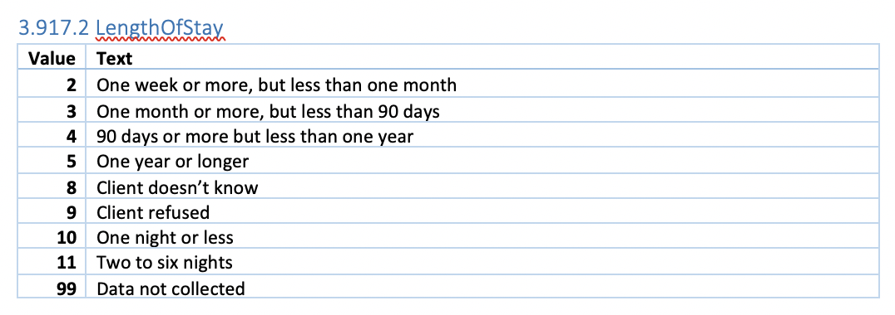

# LongName
A module to convert codes to long names from the HMIS dataset

HMIS Datasets often contain a lot of column that are encoded using identifiers. To understand the meaning of a particular value, one has to look it up in the HMIS data dictionary.
For example, Enrollment.csv contains a column called 'Length of Stay' which takes nine possible values as follows:

With multiple columns being encoded with some of them taking 35+ possible values, it is difficult to remember what each value represents.

addLongName function will insert a column looking up its value from the data dictionary and insert it next to the column you passed.

Returns a DataFrame with additional LongName column

#### Parameters:
<li> df : DataFrame of interest</li> 

<li> col: columnn whose long name is to be appended to the DataFrame</li> 

#### Returns:
<li> df : DataFrame with new column inserted at (location of) column + 1 index</li> 
  

This module is intended to be a reusable function as follows:

### Currently the module supports following columns - 
<li>Living Situation Option List</li>
<li>Disability Type</li>
<li>ProjectType</li>
<li>HousingType</li>
<li>HouseholdType</li>
<li>GeographyType</li>
<li>Ethnicity</li>
<li>Gender</li>
<li>LengthOfStay</li>
<li>TimesHomelessPastThreeYears</li>
<li>MonthsHomelessPastThreeYears</li>
